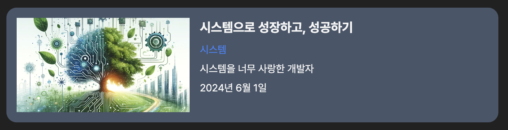

# Guesung Library

## 코드 작성 원칙

1. 비즈니스 로직과 뷰 로직을 분리한다 : 비즈니스 로직은 utils, hooks에 작성한다. 컴포넌트에서는 비즈니스 로직을 호출하고, 뷰 로직을 작성한다.
2. @guesung/ui는 GDS(Guesung Design System)이다. GDS를 기반으로 각 프로젝트에서 필요한 컴포넌트를 작성한다.

# 컴포넌트 규칙

## Card

위와 같은 형태는 Card이다. title, coverSrc, href props를 받으며, 이 Card컴포넌트를 프로젝트 특성에 맞게 확장해서 사용하면 된다.

## ListItem

위와 같은 형태는 ListItem이다. props로 Card와 동일하게 받는다.